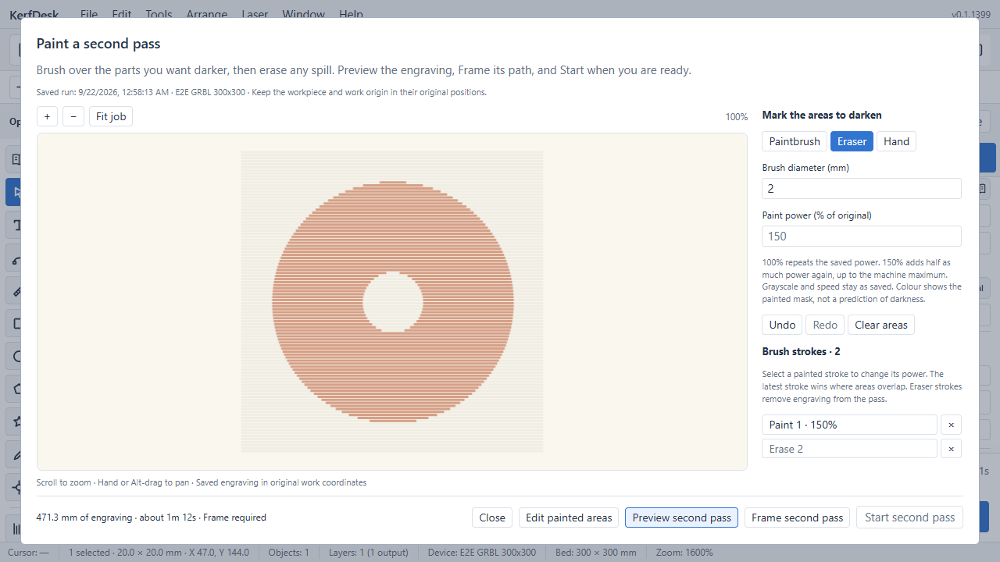
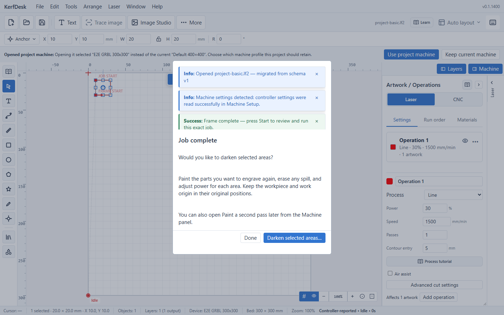

# Laser recovery and painted second-pass audit

Date: 2026-09-22. Worktree: `D:\LaserForge\disconnect-recovery-20260921`.
Scope: review the interrupted engraving changes in `2f20a553a`, implement paintbrush/eraser
second passes, and trace selection through emitted output, Frame, Start, persistence and recovery.

## Confirmed defects and corrections

| Finding | Independent evidence | Correction |
| --- | --- | --- |
| Uncertain first-write rejection could revive the older recovery offer | Actual job actions with a write that accepted a nonzero prefix then rejected; a second fixture closes the transport before rejection | Typed attempted-run identity survives teardown. Retain the attempted run and interruption; do not restore the prior capsule. Laser, manual, ordinary Start and CNC callers share the distinction. |
| Runtime recovery still trusted diagnostic coordinate metadata | Altered finite canvas offset/origin passed artifact integrity and moved the same point from `(5,395)` to `(1394,1283)` | Rebuild runtime mapping from canonical sealed source and current qualified controller evidence. |
| Few blocks with many sampled arc points escaped compaction | 3,501 blocks / 497,002 points estimated at 73,319,428 bytes, above 64 MiB | Point-count trigger packs the same route to about 12.2 MB. Every movement survives hydration. |
| Progress arriving during normal post-accept archival raised a false failure warning | Browser screenshot; focused test receives `{ok:true,value:false}` from progress update before activation | Defer progress until its active slot exists, preserving retry watermarks. Richer terminal records supersede queued progress. Actual storage failures remain reported. |
| A click could paint executable output without a visible mask | Chrome renders a `[p,p]` zero-length stroked line with zero pixels, while the capsule model selects a disk | Deduplicate the final point and render all-coincident stored strokes as disks. Browser pixel checks cover paint and erase. |
| Pointer geometry was shifted by the canvas border | Pointer origin used the outer bounding rectangle; canvas content began one pixel inside | Subtract border offsets for brush and wheel anchors; normalise backing-store scaling to actual CSS dimensions. |
| Reusing ordinary review could compile the unrelated open document | Confirm's existing rebuild read live canvas state | Frozen second-pass review refreshes controller facts while retaining exact selected bytes. |
| Initial second-pass runtime metadata and review facts referred to the original job | Work-coordinate preview had no current WCO/epoch/approach; source group/runway counts described unselected output | Requalify live route with fresh controller evidence and worker-built actual approach; derive review facts from selected output. |
| Painting a different historical job replaced the earlier brush draft | Independent A/B reopen regression against a single global storage key | Keep up to 20 drafts, bound to exact run ID and all fingerprint fields; atomic replacement preserves prior bytes on quota failure. |
| A cached worker proof could accept changed source lineage after an await | Fault injection changes resume history or coordinate metadata after worker verification; no normal UI mutation trigger was established | Snapshot small execution metadata before awaits, compare before/after replies, clone inherited stages and bind Frame to the independent worker result. Large raster graphs are not serialised again. |
| Recovery and second-pass controls lacked contextual hover help | Repository-wide JSX contract identified 28 controls, including the earlier restart picker | Add short action-specific explanations while preserving the visible workflow guidance and control behaviour. |
| Out-of-order source verification could restore an older worker cache | Deferred A/B validation reproduced output at Y0/S100 after B at Y10/S200 had already verified; pending/failed replacement and failed drawing cases also covered | New initialisation clears the prior cache immediately. Only the current generation can install its source, after both verification and preview construction succeed. The present UI uses one source per worker; the worker boundary is now independently correct. |

## Selection and executable-output contract

- Source = independently verified retained execution, not the current editor. The browser test
  moves the open artwork to X47 after completion and verifies painting/recovery leave it there.
- Selection = ordered round brush strokes in original work millimetres; eraser removes coverage.
  Latest covering stroke owns an overlap. Per-stroke power multiplies original S; the saved
  maximum caps clipping, with disclosure. Repeated source passes remain deliberate source passes.
- Output = original selected feed sweeps, tonal modulation and useful dark runways. Unpainted
  intervals receive S0, and positioning is beam-off. Unselected sweeps disappear. No raster
  re-dithering, pixel resampling or scan-direction reset occurs.
- Frame = exact derived motion bounds, including retained unpowered sweep extent, plus the
  existing controller-owned return/settlement. Start = one review, one owned permit, final fresh
  controller handoff and the exact prepared string. Editing or closing revokes that permit.
- Persistence = new run ID, durable intent, exact archive, sealed ordered paint/resume lineage.
  Canonical reconstruction must reproduce archived bytes after another disconnect and resume.

## Implementation locations

- `src/core/laser-second-pass/`: strict source parser, analytic brush intersections, overlap/erase
  resolution, beam-off writer and independent output tests.
- `src/ui/laser/second-pass/`: brush/eraser canvas, saved drafts, preview worker, packed display,
  history selector and the Frame/Start workbench.
- `src/ui/laser/second-pass-execution.ts` and `second-pass-preparation-proof.ts`: frozen source,
  owned Frame/Start handoff, current controller binding and asynchronous ownership checks.
- `src/ui/laser/job-review/`: immutable selected-pass review, current machine facts and exact
  derived metrics without recompiling the open document.
- `src/ui/state/recovery/` and `src/ui/laser/recovery-artifact-binding.ts`: archive integrity,
  ordered paint/resume lineage, canonical replay and point-heavy route packing.
- `src/ui/state/laser-job-actions.ts`, the Start/recovery transmission callers and
  `src/ui/app/use-job-checkpoint.ts`: uncertain-write ownership and deferred progress tracking.
- `e2e/production-workflows.spec.ts`: browser completion, painting, erased pixels, power edits,
  persistence, explicit Frame/Start and exact derived recovery.

## Verification evidence

- Core suite: 55 tests covering actual prepared Falcon grayscale and dither-compatible image
  paths, reverse rows, scan offsets, corrected pixel edges, controlled-dark G1 travel, repeated
  source passes, native fill and curved artwork emitted as G1. Independent distance/exposure
  oracles include 150 arbitrary brush/motion cases. A 90,000-motion source selects one row.
- Recovery fault suites: first-write uncertainty with and without preceding close callbacks,
  sealed source mapping, point-heavy archive packing, legacy intent rollback, laser/CNC recovery
  and existing containment/settlement checks.
- Second-pass flow suites: immutable Frame and review, cancellation/double Start, revoked permit
  during durable intent, first-write uncertainty, worker proof, fresh WCO and position drift,
  original Current Position placement, disconnect → recovery → another selected pass, and
  transform-metadata tamper refusal. Twelve additional fault-injection tests cover proof metadata
  changes during worker/Frame awaits and independent ownership of placement/profile data.
  Four worker-cache tests cover out-of-order verification and unsuccessful replacements.
- UI/worker suites: all five origin transforms, inches normalisation, tonal source parsing,
  worker cancellation/failure ownership, per-source draft retention/failure/migration and enabled
  Abort during streaming and post-job settle.
- Preview performance: packed binary64 paths with 256-segment bounds and bounded native canvas
  batches. An isolated local Chrome benchmark rendered 1,000,000 segments in about 92 ms versus
  about 919 ms before batching; the zoomed view took about 1 ms. This is a local measurement,
  not a device-independent latency guarantee. Geometry remains complete; only display opacity
  is quantised. The executed laser power and coordinates are unchanged.
- Browser: a completed image is painted, erased, power-adjusted, previewed, closed/reopened,
  framed, edited (invalidating Frame), reframed, reviewed, started and disconnected. Its exact
  derived recovery remains available. Painting and preview produce no motion commands.
- Check commands and final outcomes are recorded with the implementation handoff; no physical
  controller, material, deployment, publication or merge is part of this audit.

### Final checks

| Check | Result |
| --- | --- |
| `pnpm test --maxWorkers=2` | 2,211 files / 14,671 tests passed; 14 files / 22 tests skipped. Its sole failure was the hover-help contract described above, subsequently corrected and rerun successfully. Full-run duration: 2,069.55 seconds. |
| `vitest run src/core/laser-second-pass` | 55 geometry/output tests passed. |
| Final second-pass execution, proof, UI/worker and hover-help suites | All 60 tests passed across nine files after integration. |
| Pending-archive and existing checkpoint-observer suites | 14 tests passed. |
| Playwright disconnect, large-image restart and painted-pass workflows | All three passed; the finished painted-pass interface was rerun successfully after integration. |
| `pnpm build:web` | Passed, including the worker bundles and service worker. Existing large-chunk advisories remain. |
| `pnpm typecheck` and `pnpm typecheck:e2e` | Passed. |
| `pnpm format:check` and final edited-file formatting | Passed. |
| `pnpm lint`, final edited-file lint and hover-help contract | Passed. |
| File-size, index-export and ADR-number gates; `git diff --check` | Passed. Soft file-size reporting remains advisory. |

### Completion prompt follow-up

The user clarified that recovery and selective second passes are separate experiences, and
requested an automatic offer to darken selected areas once a job completes. **Job complete**
now offers **Darken selected areas…** and **Done**. The manual completed-job selector remains.

The checkpoint observer publishes only a still-owned local completion after successful terminal
tracking. The UI waits for its exact verified receipt, including delayed post-accept archive
activation. Historical hydration, interrupted streams, and CNC completions do not produce the
prompt. An App-shell host preserves access with the Machine panel collapsed and waits behind
other modals. Both entry points use the same verified source and existing paint/erase workflow.

Independent review found and regression tests reproduced two integration defects before their
fixes: archive loading could open an older editor after a newer run began, and successive prompt,
loading and editor dialogs lost the original focus target. Pending reads now cancel on new-run
ownership; focus returns across the entire editor session without stealing from another modal.
These changes do not alter machining bytes, power interpretation, recovery selection, or Frame.

Follow-up verification: all 44 tests across seven focused suites passed, including 13 prompt/editor
cases and eight completion-event cases. Three isolated-browser workflows passed: collapsed-panel
completion offer, cable-disconnect recovery, and painting/erasing/power adjustment with interrupted
second-pass recovery. A further browser run verified focus restoration through the actual editor,
prompt dismissal and reload behaviour. Edited-file lint, TypeScript/E2E checks, formatting, and
file-size/ADR/export gates passed. The production web build passed; existing bundle-size advisories
remain. Earlier browser attempts reused an unrelated older dev server;
the passing runs explicitly started this worktree's server on an isolated port.

Release integration also reproduced a short-job completion race with the actual serial handlers:
the final acknowledgement could arrive before the first write or hosted-refill arming returned.
The `start-arming` reservation prevented the normal settle marker from starting, then a later Idle
removed the stream without completion proof. A late old Start could also clear a replacement
run/session's reservation. The regression covers both arrival orders and preserves the distinction
between accepted, failed and superseded runs; confirmed completion must still use the existing
driver-specific settle marker and two fresh Idle reports.

Start now releases only its own controller/session/stream reservation and retries settlement after
successful transmission and hosted handover. Nine actual-handler regressions pass, including early
ACKs, uncertain writes, superseded starts and pre-wire rejection. The adjacent lifecycle,
containment and checkpoint suites passed all 38 tests across six files; final TypeScript,
edited-file lint, formatting and whitespace checks passed.

### Integrated release verification

The complete `pnpm release:check` passed after integration with main `39eebb6fc`: 2,237 test files and
14,902 tests passed, with 14 files / 22 tests skipped. All 130 release-integrity tests, lint,
type checks, formatting, repository gates, web build and Electron main build passed. Browser
type checking, discovery, cold startup and the production-bundle smoke passed.

The full development browser run passed 145 workflows and exposed one startup-fixture timing
failure. The identical assertion also failed on unchanged main (`39eebb6fc`). Diagnostics showed
successful startup with no application or HTTP errors: cold development modules needed 27.6 seconds
after the held entry request was released, while warm loads took 6.0 seconds. The startup test now
waits for `DOMContentLoaded` before its unchanged 10-second workspace-render assertion, as the
adjacent startup test already does. This corrects the test's load boundary without changing
production startup behaviour or relaxing the render assertion.
All four startup scenarios passed after this correction, with no production code change.

The subsequent workspace-controls integration from main `e774f79a5` retains the visible interruption
and second-pass entries while keeping manual history/restart inside the new **History & recovery**
disclosure. The painted-pass decision is now ADR-341, preserving upstream ADR-340. The new dock
completion acknowledgement and the separate darkening offer retain their distinct display/archive
ownership; the affected completion and recovery workflows are checked again after this integration.
All 98 focused tests across 11 files passed, including completed-notice controller simulations,
checkpoint ownership, the prompt and Start arming. All four affected browser workflows passed;
the manual restart test now opens the upstream history disclosure before finding its control.
Application/E2E type checks, scoped lint, formatting and the ADR gate passed after integration.

## Physical and product limits

Software tests and fake Web Serial establish the application contract, not physical burn fidelity.
The reported immediate Falcon pause on minimising Chrome is not reproduced on hardware here.
The earlier scheduling-gap correction addresses a demonstrated false watchdog disconnect; it does
not prove the cause of the immediate pause. Acknowledgements can be ahead of executed motion.

Qualification still needs the user's Falcon, firmware, USB connection and Chrome configuration:
minimise/restore during a supervised scrap engraving; disconnect/reconnect and recover with the
same work zero; then run a painted pass with a visible erased hole and two power settings. Check
alignment, darkness, edge behaviour, unpowered travel and completion on that material.

The transformer currently supports generated flat XY laser programs. It explicitly refuses native
external arcs, coordinate-changing commands, Z/rotary motion, dwell and stationary M3 exposure.
History remains bounded (20 terminal runs / 100 MiB, 64 MiB per artifact); if an original ancestor was evicted, only a
remaining stored artifact's actual coverage is selectable. Brush drafts for up to 20 sources are
local to this browser/device. No unsupported command is silently ignored to make a pass appear
successful.
