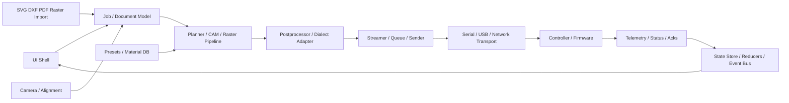
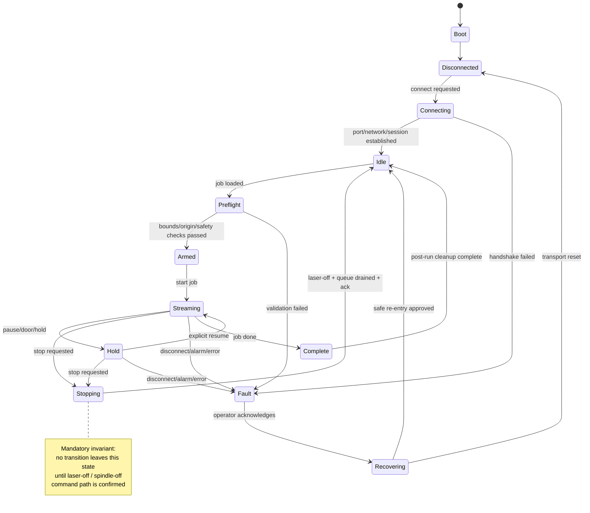
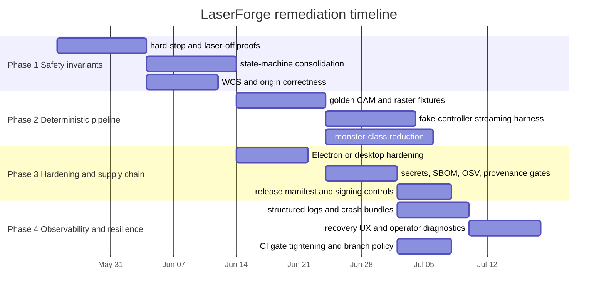

# External Repo Study and Audit

## Executive summary

Save this document as `external-repo-study-and-audit.md`. Its purpose is to give your team a single, professional Markdown framework for studying external laser and CNC repositories, extracting implementation patterns, and then auditing LaserForge against those patterns without overstating what has or has not been verified. The scope should explicitly cover Rayforge, MeerK40t, LaserGRBL, LaserWeb4, VisiCut, LibLaserCut, K40 Whisperer, Universal G-Code Sender, bCNC, Candle, and OpenBuilds CONTROL, while treating the LaserForge repository path as `UNSPECIFIED` until the team resolves it locally. The strongest public comparators are not interchangeable: Rayforge is the clearest modern product benchmark because its official docs expose repeatable dev workflows and its published feature set includes materials, presets, camera integration, alignment aids, projector mode, and headless operation; MeerK40t is the breadth benchmark for controller support and plugin extensibility; UGS, bCNC, Candle, LaserGRBL, LaserWeb4, OpenBuilds CONTROL, VisiCut, LibLaserCut, and K40 Whisperer each contribute important patterns for sender behavior, packaging, legacy compatibility, or hardware abstraction. citeturn15view0turn5view5turn3view1turn13search3turn3view7turn3view8turn20view0turn3view2turn3view3turn3view10turn10view4turn10view5turn3view6

The study file should be opinionated about evidence quality. Some repositories expose first-class build and test instructions in public documentation, especially Rayforge, Candle, and UGS. Others expose enough manifests to infer a disciplined workflow but not enough to treat every command as confirmed, especially LaserGRBL, MeerK40t, LaserWeb4, OpenBuilds CONTROL, bCNC, VisiCut, LibLaserCut, and the GitHub mirror used for K40 Whisperer. That means the Markdown must distinguish `VERIFIED`, `PARTIALLY VERIFIED`, and `UNVERIFIED` commands, and must require every substantive claim to be backed either by an official source or by a recorded local verification artifact. citeturn15view0turn20view0turn35search1turn26search1turn13search1turn8view1turn8view5turn34search1turn10view4turn10view5turn36search3

The file should also be ruthless about the comparison target. Because LaserForge is intentionally `UNSPECIFIED` in this report, every LaserForge comparison needs search heuristics, path placeholders, and acceptance gates rather than invented findings. That is the right trade: it keeps the report deployable now, while preventing the team from drifting into speculative audit prose.

## Research basis and audit rules

The study file should begin with a short "source-of-truth" note saying that primary or official sources win by default: project GitHub repositories, official project docs, official websites, and official tool documentation. For this repo set, that means using project repositories and official docs such as Rayforge's installation and developer setup pages, Candle's README build instructions, UGS's README development section, OpenBuilds CONTROL's repository and workflow files, the official Scorchworks K40 Whisperer page, and the public manifests checked into each project. citeturn14search1turn15view0turn20view0turn35search1turn31view0turn3view6turn6view0turn6view4turn6view6

The opening rules block in the Markdown should read like an operating charter, not a style guide. It should define these evidence tags and require them everywhere in the document:

| Evidence tag | Meaning | Required proof |
|---|---|---|
| `VERIFIED` | Confirmed directly from official docs, repo manifests, or a recorded local run. | Citation plus command/artifact reference. |
| `PARTIALLY VERIFIED` | Source confirms some of the claim, but the full workflow was not publicly validated. | Citation plus explicit gap statement. |
| `UNVERIFIED` | Plausible or prescribed for audit efficiency, but not yet confirmed. | Must say exactly what still needs proof. |

The risk model should also be explicit and reused in every repo section and every LaserForge ticket:

| Risk class | Meaning | Mandatory acceptance gate |
|---|---|---|
| `CRITICAL` | Can cause unsafe emissions, uncontrolled motion, incorrect origin use, or insecure remote execution. | Reproducible test fixture plus reviewer sign-off and negative-path proof. |
| `HIGH` | Can corrupt jobs, break stop/pause/resume, or undermine release integrity or dependency trust. | Automated test plus artifact captured in CI. |
| `MEDIUM` | Can degrade reliability, preview correctness, or maintainability. | Test or static-analysis rule plus owner assigned. |
| `LOW` | Cosmetic, documentation, or ergonomics issue. | Logged and prioritized; no blocker unless it compounds other risks. |

The acceptance gates themselves should be standardized. The Markdown should require a claim gate, build gate, runtime gate, safety gate, and release gate for every substantive comparison. That matters because the repo set spans very different operational models: Python desktop apps, a .NET/Windows GUI, Java/Maven platforms, a Qt/CMake desktop app, and Node/Electron or Node/Webpack applications; a good audit file must normalize the evidence standard even when the stacks differ. citeturn6view0turn26search1turn19view4turn7view6turn11view3turn8view5

## Required repo-to-LaserForge research map

Use this map as the routing layer for external study. Every sector audit and every future LaserForge fix plan must name which external repository pattern was studied, what was learned, and which LaserForge module is being compared. Do not let a ticket say only "improve streaming" or "harden safety"; it must identify the source repo, evidence, local target, and action type.

| LaserForge Area / Question | Primary External Repos | Secondary External Repos | What To Learn | LaserForge Cross-Reference Target |
|---|---|---|---|---|
| Overall modern laser-app architecture | Rayforge | MeerK40t, LaserWeb4, VisiCut | Document -> operation -> plan -> output pipeline, app/module boundaries, extensibility, job model | `src/app`, `src/core`, compiler/planner/output folders, project/document model |
| GRBL streaming and serial sender behavior | LaserGRBL, Universal G-Code Sender | bCNC, Candle, OpenBuilds CONTROL | Queueing, ok/ack handling, buffer management, retry behavior, disconnect handling, line numbering/checksums if used | `GrblController`, serial adapter, stream queue, sender tests |
| Pause / resume / stop / emergency-off behavior | LaserGRBL, UGS, OpenBuilds CONTROL | bCNC, Candle | Whether pause forces laser-off, resume modal reassertion, stop/abort semantics, disconnect fault behavior | `ExecutionCoordinator`, `MachineService`, `GrblController`, safety tests |
| Laser-on / laser-off command safety | LaserGRBL, Rayforge | K40 Whisperer, MeerK40t | `M3`/`M4`/`M5` handling, dynamic laser mode, power gating, test-fire/deadman patterns | laser command builder, test-fire flow, stream validators, `M5` emergency paths |
| Device/controller abstraction | MeerK40t, LibLaserCut | Rayforge, VisiCut, UGS | Capabilities model, driver interface, plugin model, controller-specific behavior isolation | controller interfaces, device profiles, capability flags, firmware adapters |
| GRBL vs broader controller support | MeerK40t, LibLaserCut, VisiCut | Rayforge | How mature apps avoid hardcoding one firmware model while avoiding premature complexity | controller architecture, future DSP/Ruida/Galvo extension points |
| Raster/image engraving pipeline | LaserGRBL, Rayforge | LaserWeb4, MeerK40t | Dithering, halftone, grayscale mapping, scanline generation, image preprocessing, preview parity | raster pipeline, image processing, scanline planner, raster tests |
| Vector import and CAM pipeline | LaserWeb4, Rayforge, VisiCut | K40 Whisperer, MeerK40t | SVG/DXF import, normalization, path cleanup, operations, cut/engrave separation | SVG/DXF importers, scene graph, operation model, geometry tests |
| Preview / simulation / visualizer | Rayforge, Candle, UGS | LaserGRBL, LaserWeb4 | Plan-based preview, G-code visualizer, time estimation, bounding box verification | preview renderer, simulator, bounds checking, time estimator |
| WCS / origin / homing / coordinates | UGS, bCNC, Candle | LaserGRBL, OpenBuilds CONTROL | Machine vs work coordinates, `G54`/`G92` handling, homing assumptions, soft limits, origin certainty | WCS placement certainty, coordinate transform logic, bounds/preflight tests |
| Material presets and beginner workflow | Rayforge, LaserGRBL | Light workflow ideas from K40 Whisperer | Material library, speed/power/pass presets, beginner-safe guided flow | material preset model, job wizard, preflight warnings, UX state |
| Camera/alignment future architecture | Rayforge | MeerK40t | Camera calibration, bed alignment, image overlay, coordinate mapping | future architecture notes only; do not implement unless explicitly scoped |
| Electron/Node desktop security | OpenBuilds CONTROL | LaserWeb4 | IPC boundaries, local server risk, serial permissions, updater/release flow, CSP lessons | Electron main/preload/renderer boundaries, IPC allowlist, CSP, release scripts |
| Legacy design mistakes to avoid | LaserWeb4, K40 Whisperer, bCNC | Candle | Aging dependencies, monolithic UI/controller coupling, unsafe trust boundaries, weak tests | architectural risk notes, anti-patterns in `LASERFORGE_FIX_PLAN.md` |
| Minimal/simple beginner UX | K40 Whisperer, Candle, LaserGRBL | OpenBuilds CONTROL | What the shortest useful workflow looks like; where LaserForge is overcomplicated | job start wizard, connection panel, settings flow, first-run experience |
| Test strategy and fake controllers | UGS, Rayforge, MeerK40t | LaserGRBL if tests exist | Fake devices, parser fixtures, simulation tests, regression tests, integration boundaries | test harnesses, fake GRBL controller, controller state tests, pipeline fixtures |
| Release/package/distribution workflow | OpenBuilds CONTROL, LaserGRBL | UGS | Installer, updater, platform packaging, release checks, signing lessons | release workflows, package scripts, artifact checks, production hardening |
| Observability and support diagnostics | Rayforge, OpenBuilds CONTROL | UGS, MeerK40t | Logs, diagnostics bundles, crash handling, support evidence | diagnostics, job replay, machine event ledger, support bundle policy |

## Required fix-plan linkage

Every item in `LASERFORGE_FIX_PLAN.md` must include these fields:

```md
Learned from: Rayforge / LaserGRBL / UGS / etc.
Evidence: <repo file path, command output, or audit artifact>
LaserForge target: <local file/module/test>
Action type: COPY CONCEPT | ADAPT PATTERN | REJECT PATTERN | BLOCKED | NEEDS MANUAL REVIEW
```

Allowed action types mean:

| Action type | Meaning |
|---|---|
| `COPY CONCEPT` | Use the same high-level idea, but implement it in LaserForge's own code style and architecture. |
| `ADAPT PATTERN` | Borrow part of the approach while changing it for LaserForge's Electron/GRBL/safety model. |
| `REJECT PATTERN` | Record why the external approach is unsafe, obsolete, incompatible, or too broad for LaserForge. |
| `BLOCKED` | Do not implement until missing evidence, product direction, or hardware behavior is resolved. |
| `NEEDS MANUAL REVIEW` | Requires owner review before implementation because it touches safety, licensing, release, or hardware behavior. |

If a fix is not linked to external repo evidence or the LaserForge static audit baseline, mark it:

> UNSOURCED - do not implement until evidence is added.

Required output artifacts for this study:

- `external-repo-study-and-audit.md`
- `REPO_TO_LASERFORGE_RESEARCH_MAP.md`
- `LASERFORGE_FIX_PLAN.md`
- repo-specific study notes under the chosen audit evidence folder
- local command artifacts, logs, screenshots, and transcripts referenced by the evidence fields

## Repository acquisition and study workflow

Use one intake table near the top of the Markdown so the team can clone, install, build, test, lint, and smoke each repository without inventing commands on the fly. The commands below are either pulled directly from official docs/manifests or are deliberately marked `UNVERIFIED` when public sources do not fully confirm them. citeturn15view0turn13search1turn26search1turn16search4turn19view4turn10view5turn3view6turn35search1turn34search1turn20view0turn8view5

| Repo | Stack and public signals | Clone command | Install, build, test, lint, security study steps | Minimal runtime check | Confidence | Source basis |
|---|---|---|---|---|---|---|
| Rayforge | Python app with `pyproject.toml`, `requirements.txt`, GUI entrypoint, Ruff/Pyright/Mypy/Pytest config, plus official Pixi and Windows dev wrappers. | `git clone https://github.com/barebaric/rayforge.git` | Linux: `pixi run test`, `pixi run lint`, `pixi run format`, `pixi run rayforge`. Windows: `.\run.bat setup`, `run test`, `run lint`, `run format`, `run build`. Run secret and SBOM scans after install. | `pixi run rayforge -- --loglevel=DEBUG` or `run app --loglevel=DEBUG` | `VERIFIED` | Official docs citeturn6view0turn15view0turn3view0 |
| MeerK40t | Python repo with `requirements.txt`, `requirements-dev.txt`, `pyproject.toml`; official source guidance says `pip install meerk40t[all]` and `meerk40t`; dev requirements include `pytest` and `flake8`. | `git clone https://github.com/meerk40t/meerk40t.git` | `python -m venv .venv && source .venv/bin/activate && pip install -r requirements.txt -r requirements-dev.txt && pytest && flake8`. Packaging/build command should be captured during local verification. | `python meerk40t.py` | `PARTIALLY VERIFIED` | Official repo and docs citeturn3view1turn13search1turn13search9turn13search3 |
| LaserGRBL | Windows GUI for GRBL; official README says C# and .NET Framework 3.5+; solution file, tests folder, and Inno Setup script are present; current `.github` tree does not show active workflows. | `git clone https://github.com/arkypita/LaserGRBL.git` | `nuget restore LaserGRBL.sln && msbuild LaserGRBL.sln /p:Configuration=Release`. Packaging: `iscc setup.iss`. Test runner must be confirmed from `LaserGRBL.Tests.csproj` before use; treat CLI testing as `UNVERIFIED` until framework details are checked. | `.\LaserGRBL\bin\Release\LaserGRBL.exe` | `PARTIALLY VERIFIED` | Official repo files citeturn3view2turn26search1turn11view1turn22view0turn26search2 |
| LaserWeb4 | Node/Webpack development environment with `package.json`, `package-lock.json`, submodule workflow, and documented `bundle-dev` start path. | `git clone --recurse-submodules https://github.com/LaserWeb/LaserWeb4.git` | `npm install && npm run installdev && npm run bundle-dev && npm start`. Build docs also reference `docker run ... joesantos/laserweb:latest` and the wiki "How to compile" page. No public `test` script was visible in retrieved docs. | `npm start` and confirm both frontend and comm server start. | `PARTIALLY VERIFIED` | Official repo and wiki citeturn8view1turn7view2turn3view3turn16search4 |
| VisiCut | Java/Maven app with `pom.xml`, main class in manifest, shaded `full` jar, GitHub Actions folder, Travis file, and README pointing to wiki for hacking. | `git clone --recurse-submodules https://github.com/t-oster/VisiCut.git` | `mvn -q -DskipTests=false clean package` and `./test.sh` if maintained locally. Security scans should include Maven dependency review and SBOM generation. | `java -jar target/visicut-*-full.jar` | `PARTIALLY VERIFIED` | Official repo files citeturn10view4turn19view4turn19view0turn19view3 |
| LibLaserCut | Java/Maven library backing VisiCut; `pom.xml`, test script, GitHub workflows folder, and broad hardware support documented. | `git clone https://github.com/t-oster/LibLaserCut.git` | `mvn -q -DskipTests=false clean test package && ./test.sh`. Also run dependency and SBOM scans because this library is a hardware abstraction layer. | Library only; verify by `mvn test` and any consuming sample path you add locally. | `PARTIALLY VERIFIED` | Official repo files citeturn10view5turn3view5 |
| K40 Whisperer | Official upstream instructions live on Scorchworks; the GitHub repo commonly studied is a macOS packaging fork with `requirements.txt`, Linux setup notes, `py2exe` packaging, and build scripts. | `git clone https://github.com/stephenhouser/k40-whisperer.git` | `python -m venv .venv && source .venv/bin/activate && pip install -r requirements.txt`. Linux setup must also follow `README_Linux.txt` group and `udev` steps. Packaging: `python py2exe_setup.py py2exe` or `./build-macOS.sh`. Public automated tests were not found. | `python k40_whisperer.py` after dependencies and USB prerequisites are in place. | `PARTIALLY VERIFIED` | Official Scorchworks page plus repo mirror files citeturn3view6turn36search3turn37search0turn36search1turn37search2 |
| Universal G-Code Sender | Java/Maven multi-module project with wrapper scripts, Java 17 property, Surefire, JaCoCo, and official run commands for Classic and Platform editions. | `git clone https://github.com/winder/Universal-G-Code-Sender.git` | `./mvnw install && ./mvnw test && ./mvnw exec:java -Dexec.mainClass="com.willwinder.universalgcodesender.MainWindow" -pl ugs-core && ./mvnw nbm:run-platform -pl ugs-platform/application` | Run either Classic or Platform using the documented commands above. | `VERIFIED` | Official README and POM citeturn35search1turn3view7turn7view6turn7view7turn8view3 |
| bCNC | Python 3.8+ app with setuptools entrypoint, pip install instructions, tests folder, and Travis recipe showing compile, sdist, and historically disabled pytest smoke tests. | `git clone https://github.com/vlachoudis/bCNC.git` | `python -m venv .venv && source .venv/bin/activate && pip install -e . && python -tt -m compileall -f bCNC && python setup.py sdist`. historical test path: `pytest --capture=no --verbose tests/` but treat as `UNVERIFIED` because current Travis disables it. | `python -m bCNC` | `PARTIALLY VERIFIED` | Official README, setup, Travis file citeturn33search1turn19view8turn8view4turn34search1turn3view8 |
| Candle | Qt desktop app with `CMakeLists.txt`, `CMakePresets.json`, vcpkg files, and exact Windows and Linux build instructions in README. | `git clone https://github.com/Denvi/Candle.git` | Linux: install Qt dev packages, then `mkdir build && cd build && cmake .. -DCMAKE_INSTALL_PREFIX="$HOME/programs/Candle" && cmake --build . --config=Release && cmake --install .`. Windows: install CMake and vcpkg, set `CMAKE_TOOLCHAIN_FILE`, then configure/build/install as documented. | Launch the installed binary from the install prefix. | `VERIFIED` | Official README and repo tree citeturn20view0turn11view3 |
| OpenBuilds CONTROL | Electron app with `package.json`, `electron-builder`, `serialport`, `express`, `socket.io`, real GitHub Actions workflow, and a placeholder `test` script that does not execute tests. | `git clone https://github.com/OpenBuilds/OpenBuilds-CONTROL.git` | `npm install && npm run run-local`. For release study, inspect `.github/workflows/build.yml` and package `build` config. Do not treat `npm test` as coverage; the current script is a placeholder. | `npm run run-local` | `PARTIALLY VERIFIED` | Official repo files and workflow citeturn8view5turn9view7turn9view8turn30view0turn31view0turn32view2 |

The Markdown should then require the same study sequence for every repo: pin a commit hash, record manifest files, install dependencies in a clean environment, run the documented build, run tests and linters if they exist, run secret and SBOM scans, launch the smallest viable runtime smoke test, and capture every artifact path in the document. That workflow is especially important for the mixed sender-and-controller surface in OpenBuilds CONTROL, LaserWeb4, Rayforge, MeerK40t, and UGS, where build success alone tells you very little about pause/resume semantics, disconnect handling, coordinate trust, or communication logging. citeturn8view5turn7view2turn15view0turn14search12turn13search3turn35search1

## Consistent audit template and diagrams

The Markdown should include one reusable repo section template and require the team to copy it once per repository. This is the right place to enforce the "verify before claiming" discipline, because it forces evidence, commands, diagrams, and risks into the same shape for every repo.

````md
## <Repo name>

**Status:** VERIFIED | PARTIALLY VERIFIED | UNVERIFIED  
**Pinned commit:** <hash>  
**Primary sources:** <official repo/docs citations>  
**Auditor:** <name>  
**Date:** <YYYY-MM-DD>

### Executive take
A short analytical paragraph. What this repo is. Why it matters to LaserForge. What is already known versus still unverified.

### Repo summary
- Mission and scope
- Release model
- Maturity signals
- Why this repo is relevant to LaserForge

### Stack and language
| Area | Evidence | Notes |
|---|---|---|
| Primary language | | |
| Build system | | |
| Packaging | | |
| UI framework | | |
| Runtime channels | serial / USB / network / file | |

### Build, run, test, lint, security steps
```bash
# clone
git clone <repo-url>
cd <repo-name>

# install
<exact commands>

# build
<exact commands>

# tests
<exact commands or UNVERIFIED>

# lint / type checks
<exact commands or UNVERIFIED>

# security
<exact commands>

# minimal runtime smoke
<exact commands>
```

### Architecture diagram


### Controller and firmware support
What is explicitly documented. What is inferred. What still requires code confirmation.

### G-code and raster pipeline
Input formats, planner/CAM stages, postprocessor behavior, streaming model, preview or simulation model.

### Safety-relevant surfaces
- Laser-off guarantees
- Pause / resume / stop / abort semantics
- WCS / origin / homing / soft-limit handling
- USB / serial / TCP trust boundary
- Offline import vs live-control separation
- Crash, disconnect, or shutdown behavior

### Tests and coverage
What automated tests exist, what test types exist, what coverage signals exist, what is missing.

### CI gates
What CI exists, what it actually enforces, and where quality gates are fake or missing.

### Dependency and supply-chain risks
SBOM state, package freshness, provenance, signing, secret hygiene, release process.

### Data lifecycle
Inputs, transformations, logs, settings, telemetry, project files, crash bundles, retention expectations.

### UX patterns
Presets, preview, simulation, camera, project model, onboarding, recovery flows, observability.

### License and compatibility
License, copyleft implications, compatibility notes for LaserForge reuse or inspiration.

### Findings
| ID | Risk | Finding | Evidence | Recommendation |
|---|---|---|---|---|

### Repo-specific tickets
| Ticket | Priority | Work | Verification | Owner |
|---|---|---|---|---|
````

The Markdown should also include one recommended state-machine diagram for LaserForge itself. This is not a claim about the current codebase; it is the target model the team should use when comparing external repos and hardening LaserForge.



That state model is the right audit lens because the repo set repeatedly surfaces the same hard problems in different forms: sender queuing, graphical preview, transport abstraction, controller heterogeneity, resume/hold semantics, and packaging around unsafe machines. UGS, bCNC, OpenBuilds CONTROL, Candle, LaserGRBL, and MeerK40t all expose parts of that problem, but none absolve LaserForge from proving its own invariants. citeturn35search1turn34search1turn8view5turn20view0turn26search1turn13search3

## Cross-reference matrix and repo baselines

Your Markdown should contain at least one cross-reference matrix table and, realistically, two. One should focus on machine-control and safety surfaces; the other should focus on product capabilities and quality posture. Because the LaserForge path is intentionally unresolved here, the LaserForge column should stay `UNSPECIFIED` until the team runs the local discovery block and fills it with evidence.

| Repo | Controller support | Safety model publicly visible | State-machine evidence | Network/Electron surface | Immediate LaserForge comparison prompt | Baseline quality |
|---|---|---|---|---|---|---|
| Rayforge | GRBL, Marlin, Ruida, Smoothieware are documented. citeturn3view0 | Connection docs and communication-log capture are documented, but hard stop invariants still need code proof. citeturn14search12turn14search14 | `AUDIT REQUIRED`; public docs do not fully spell out transitions. | GTK desktop app, not Electron. citeturn3view0turn6view0 | Compare LaserForge job/state boundaries, presets, camera, and diagnostics against Rayforge first. | Strong modern benchmark. |
| MeerK40t | K40/Lihuiyu, GRBL, Ruida, Moshiboard, Newly, Balor are described in repo docs. citeturn13search3 | Broad multi-device breadth, but safety semantics still need local proof. | `AUDIT REQUIRED`; plugin architecture is public, full transitions are not. | Python/wx stack; no Electron surface. citeturn13search9turn13search1 | Use for controller breadth and extension architecture. | Breadth benchmark. |
| LaserGRBL | GRBL 0.9 and 1.1 are explicitly supported. citeturn3view2 | Sender behavior is public, but stop/hold/origin semantics need code verification. | Emulator folder exists, but public transition model is not documented. citeturn23view0 | Windows C# GUI; no Electron/CSP surface. citeturn26search1 | Compare lean Windows sender flows, raster import, and packaging. | Narrow but practical benchmark. |
| LaserWeb4 | Generates G-code and controls supported CNC/laser firmwares; exact firmware list needs local confirmation from docs/code. citeturn16search2turn3view3 | Comm-server split suggests explicit trust boundary work is required in audit. | `AUDIT REQUIRED`. | Node/Webpack plus separate comm server; not primarily Electron in retrieved sources. citeturn8view1turn7view2 | Compare web/server split, CAM pipeline, and server trust model. | Useful architecture benchmark. |
| VisiCut | Hardware support delegated through LibLaserCut. citeturn10view4turn10view5 | Job-preparation vs driver abstraction split is useful; full safety semantics still need code review. | `AUDIT REQUIRED`. | Java desktop; no Electron. citeturn19view4turn19view0 | Compare job-prep/application split and hardware abstraction boundaries. | Strong design benchmark. |
| LibLaserCut | Supports many devices including generic G-code, K40, GRBL, Smoothie, HPGL, and more. citeturn10view5 | Library abstraction surface is public; safety invariants depend on driver implementations. | `AUDIT REQUIRED`. | Java library; no Electron. | Compare driver abstraction and capability modeling. | Excellent abstraction benchmark. |
| K40 Whisperer | K40-focused; official docs emphasize direct control of cheap Chinese K40-class cutters. citeturn36search3turn3view6 | Legacy USB and board-specific semantics make it a good negative test benchmark. | `AUDIT REQUIRED`. | Python/Tk style tooling; no Electron. | Compare minimum-viable safety and driver edge cases around K40-class devices. | Legacy/edge-case benchmark. |
| UGS | GRBL, TinyG, g2core, Smoothieware are documented. citeturn3view7 | Mature sender/product split, but laser-specific stop invariants still need audit in context. | Multi-module platform signals structured state, but exact transitions still need code audit. citeturn7view6 | Java/NetBeans platform; no Electron. | Compare modular sender architecture, plugin boundaries, and CI/test posture. | Strong platform benchmark. |
| bCNC | grblHAL and GRBL are explicit. citeturn3view8 | Historic Travis work includes fake-GRBL discussion and smoke tests, but current test posture is weak. citeturn34search0turn34search1 | `AUDIT REQUIRED`. | Python/Tk; no Electron. | Compare sender, macros, probing, and test-harness ideas. | Practical sender benchmark. |
| Candle | GRBL is explicit and central. citeturn20view0 | Public build docs are strong; control semantics still need runtime study. | `AUDIT REQUIRED`. | Qt desktop; no Electron. citeturn11view3 | Compare native desktop sender responsiveness and visualizer separation. | Clean native benchmark. |
| OpenBuilds CONTROL | Grbl host; bundled firmware assets include GRBL/GrblHAL-family artifacts. citeturn11view4turn3view10 | Network and updater surface are larger because `express`, `socket.io`, and Electron packaging are in-tree. citeturn9view8turn8view5 | `AUDIT REQUIRED`. | Electron desktop with release workflow and placeholder tests. citeturn8view5turn30view0turn31view0 | Compare Electron hardening, updater, local-server trust, and release controls. | Best Electron benchmark. |
| LaserForge | `UNSPECIFIED` until the team resolves the repo path and collects manifests. | `UNSPECIFIED`. | `UNSPECIFIED`. | Search first for Electron, web server, serial, and machine-control surfaces. | Fill only from local evidence. | Must not be guessed. |

The second matrix should force product and quality comparisons, including the requested dimensions that are easy to hand-wave and hard to prove.

| Repo | Material presets | Camera features | Preview or simulation | CI gates | Test types | File-size and monster-class audit | Observability | Source basis |
|---|---|---|---|---|---|---|---|---|
| Rayforge | Public material library, preset system, and test grids are documented. | Public camera integration is documented. | Public site describes 3D simulation. | Local test/lint/build commands are documented; CI workflow audit still required. | Pytest, Ruff, Pyright are documented. | Local scan required. | Public docs mention communication logs and debugging bundles. | Official docs citeturn5view5turn14search5turn15view0turn14search12 |
| MeerK40t | `AUDIT REQUIRED`. | `AUDIT REQUIRED`. | Public issue trail confirms a simulation window exists, but product posture still needs code confirmation. | CI posture not confirmed in retrieved sources. | `pytest` and `flake8` are in dev requirements. | Local scan required. | `AUDIT REQUIRED`. | Official repo files citeturn13search1turn13search10 |
| LaserGRBL | `AUDIT REQUIRED`. | No camera feature found in retrieved public docs. | OpenGL preview and raster import are publicly described. | No active public workflow was visible in current `.github`. | Tests folder exists, but CLI runner requires confirmation. | Local scan required. | `AUDIT REQUIRED`. | Official repo files citeturn26search1turn11view1turn22view0 |
| LaserWeb4 | `AUDIT REQUIRED`. | `AUDIT REQUIRED`. | CAM/G-code generation is explicit; deeper preview study requires runtime. | CI not confirmed in retrieved public sources. | No test script found in retrieved `package.json`. | Local scan required. | `AUDIT REQUIRED`. | Official repo files citeturn3view3turn8view1 |
| VisiCut | `AUDIT REQUIRED`. | `AUDIT REQUIRED`. | Job-preparation UI is explicit; richer preview study requires runtime. | GitHub Actions folder and Travis file exist. | `test.sh` present; exact scope requires local proof. | Local scan required. | `AUDIT REQUIRED`. | Official repo files citeturn10view4 |
| LibLaserCut | Library-level, not UI presets. | N/A | N/A | GitHub workflows folder exists. | `test.sh` plus Maven tests. | Local scan required. | `AUDIT REQUIRED`. | Official repo files citeturn10view5 |
| K40 Whisperer | No public material-preset system found. | No camera feature found in retrieved official docs. | Raster and vector workflows are explicit; preview depth needs runtime confirmation. | No public automated test posture found. | No public automated tests found. | Local scan required. | `AUDIT REQUIRED`. | Official docs and repo mirror citeturn3view6turn36search1 |
| UGS | `AUDIT REQUIRED`. | No public camera feature found in retrieved sources. | Visualizer/OpenGL platform components are present. | Surefire and JaCoCo are configured; Maven test path is explicit. | Unit/integration style via Maven test lifecycle. | Local scan required. | `AUDIT REQUIRED`. | Official README and POM citeturn3view7turn35search1turn7view7 |
| bCNC | `AUDIT REQUIRED`. | No public camera feature confirmed in retrieved official docs. | Sender/editor/visualizer posture is explicit. | Travis exists but pytest path is currently commented out. | Compile, sdist, and historical smoke tests are visible. | Local scan required. | `AUDIT REQUIRED`. | Official README and Travis file citeturn33search1turn34search1 |
| Candle | No public material-preset system found in retrieved docs. | No public camera features found. | G-code visualizer is explicit. | `.github` folder exists, but exact gates should be captured locally. | No public test command found in retrieved build docs. | Local scan required. | `AUDIT REQUIRED`. | Official README and repo tree citeturn20view0turn11view3 |
| OpenBuilds CONTROL | `AUDIT REQUIRED`. | `AUDIT REQUIRED`. | Host UI and file associations are explicit; preview depth needs runtime confirmation. | Real GitHub Actions workflow exists across macOS, Windows, and Ubuntu. | `npm test` is only a placeholder in current package metadata. | Local scan required. | Local-server and updater observability should be audited first. | Official package and workflow citeturn8view5turn31view0 |
| LaserForge | `UNSPECIFIED` | `UNSPECIFIED` | `UNSPECIFIED` | `UNSPECIFIED` | `UNSPECIFIED` | Must be measured locally. | Must be measured locally. | Fill from local evidence only. |

This matrix is intentionally biased toward honesty rather than completeness. If the source basis does not support a definitive answer, the cell should stay `AUDIT REQUIRED` until the team records local proof.

## LaserForge remediation phases and exact verification suite

The prior LaserForge phase labels are not visible in the materials available to this run, so the Phase structure below is a reconstruction that matches the requested comparison dimensions: safety model, state transitions, controller trust boundaries, hardening, tests, presets, preview, and operational observability. Use these four phases unless you need to rename them to match an earlier internal audit.

| Phase | Outcome | Representative tickets | Acceptance focus |
|---|---|---|---|
| Phase 1 | Safety invariants and machine-state correctness | hard-stop behavior, laser-off guarantees, pause/resume/abort, WCS/origin handling | prove unsafe transitions cannot occur |
| Phase 2 | Deterministic job pipeline and repo maintainability | golden fixtures, fake-controller harness, monster-class reduction, preset/schema tests | prove output and state are reproducible |
| Phase 3 | Supply-chain and desktop hardening | Electron/CSP or desktop hardening, secrets, SBOM, provenance, dependency policy | prove releases are trustworthy |
| Phase 4 | Observability and operational resilience | structured logs, crash bundles, telemetry, CI gates, recovery UX | prove failures are diagnosable and recoverable |

The file/line search heuristics, fixtures, and verification commands should be recorded in a ticket table exactly like this:

| Ticket | Risk | File and line search heuristics | Fixtures to add | Verification commands |
|---|---|---|---|---|
| `LF-SAF-001` Enforce laser-off on every unsafe exit | `CRITICAL` | `rg -n "(M3|M4|M5|laser.?off|spindle|abort|stop|pause|resume|disconnect|close|shutdown)" "$LF_REPO"` and `rg -n "(try:|catch|finally|dispose|cleanup|onbeforeunload|window.onclose|serialport|ipcMain|ipcRenderer)" "$LF_REPO"` | fake controller transcript for stop, pause, disconnect, exception, window close, and process kill; expected final command stream must include off/abort path | run unit tests for controller stream layer; replay transcript fixtures; diff expected vs actual command logs |
| `LF-SAF-002` Create one authoritative machine state machine | `CRITICAL` | `rg -n "(enum .*State|createMachine|transition|reducer|status.*(idle|run|hold|alarm|door|home)|finite state|FSM)" "$LF_REPO"` | transition matrix fixture that covers connect, arm, start, hold, resume, stop, alarm, recover, disconnect | assert every transition is legal and every illegal transition is rejected |
| `LF-SAF-003` Make WCS/origin handling explicit | `CRITICAL` | `rg -n "(G54|G55|G56|G57|G58|G59|G92|origin|home|WCS|work coordinate|machine coordinate|soft limit|hard limit)" "$LF_REPO"` | SVG and G-code fixtures with known work offset, machine offset, homing enabled/disabled, upper-left and lower-left origins | preview snapshot tests; golden G-code tests; fake-controller jog and frame tests |
| `LF-SAF-004` Fence all remote or local-network trust boundaries | `HIGH` | `rg -n "(express|koa|socket.io|ws://|http://|https://|fetch\\(|openExternal|shell\\.openExternal|serialport|network|scan|discover|bonjour|mdns)" "$LF_REPO"` | hostile-input fixtures for malformed jobs, hostile websocket messages, bad serial replies, invalid update metadata | API/request validation tests; SSRF/open-external denial tests; disconnect/reconnect smoke tests |
| `LF-PIPE-001` Build golden CAM/raster fixtures | `HIGH` | `rg -n "(svg|dxf|pdf|bitmap|raster|trace|halftone|dither|postprocess|planner|toolpath)" "$LF_REPO"` | canonical SVG, DXF, bitmap, grayscale, hatch, rotary, and oversized job fixtures plus expected preview snapshots and emitted commands | snapshot tests, golden output diffs, runtime import smoke checks |
| `LF-PIPE-002` Add fake controller and long-job streaming tests | `HIGH` | `rg -n "(queue|stream|planner|ack|ok|buffer|serial|flow control|hold|resume)" "$LF_REPO"` | fake controller that can emit `ok`, delayed buffers, alarm, door, disconnect, and malformed status frames | deterministic stream/retry tests; long-file memory/time budget tests |
| `LF-PIPE-003` Kill monster classes and hidden coupling | `MEDIUM` | `git -C "$LF_REPO" ls-files | xargs wc -l | sort -nr | head -50` and `rg -n "(class .*Manager|class .*Controller|utils\\.ts|helpers\\.ts|index\\.ts|main\\.ts)" "$LF_REPO"` | characterization tests around every split candidate before refactor | line-count budget checks; preserved behavior through existing golden tests |
| `LF-HARD-001` Harden Electron or equivalent desktop surface | `HIGH` | `rg -n "(BrowserWindow|contextIsolation|sandbox|nodeIntegration|enableRemoteModule|preload|Content-Security-Policy|ipcMain|ipcRenderer)" "$LF_REPO"` | preload boundary tests, CSP violation tests, blocked external-navigation tests | desktop security smoke tests plus static config assertions |
| `LF-HARD-002` Add secret, SBOM, and dependency gates | `HIGH` | repo root plus manifest discovery | sample baseline files for expected false positives; stored allowlists checked into repo | gitleaks, trufflehog, SBOM, OSV, package-audit commands below |
| `LF-OBS-001` Add structured logs and crash bundles | `MEDIUM` | `rg -n "(logger|telemetry|metric|trace|span|audit|crash|sentry|winston|pino|opentelemetry)" "$LF_REPO"` | fake crash, failed connect, failed stream, stop-while-paused, invalid preset migration | assert crash bundle contains build id, commit, config hash, last commands, and machine status timeline |

The exact local verification suite for LaserForge should be included as a copy-paste block with placeholders. The commands below intentionally front-load discovery because the repository path is currently unresolved, and because the scan surface differs drastically depending on whether LaserForge is Node/Electron, Python, Rust, Java, or mixed-stack. Secret scanning, SBOM generation, OSV scanning, npm SBOM generation, and provenance policy are all grounded in official tool documentation. Gitleaks' historical `detect` path is deprecated, which is why the example below uses the current-style repository subcommand. TruffleHog's own guidance distinguishes repo-history scanning from flat filesystem scanning, so the Git-based form should be the primary local secret scan for a cloned repository. Syft is documented as a CLI for SBOM generation from filesystems and images, OSV-Scanner is the official frontend to OSV, and npm now ships both `npm sbom` and provenance support for package publication. citeturn38search0turn38search12turn38search1turn38search5turn38search2turn39search0turn39search1turn39search2turn39search6turn39search20turn39search24

```bash
#!/usr/bin/env bash
set -euo pipefail

LF_REPO="${LF_REPO:-UNSPECIFIED}"
if [ "$LF_REPO" = "UNSPECIFIED" ]; then
  echo "Set LF_REPO to the LaserForge checkout path before running."
  echo 'Example: export LF_REPO="$HOME/src/LaserForge"'
  exit 2
fi

cd "$LF_REPO"
mkdir -p audit-artifacts

# Basic provenance of the local checkout
git rev-parse HEAD > audit-artifacts/git-head.txt
git status --short > audit-artifacts/git-status.txt
git remote -v > audit-artifacts/git-remote.txt

# Discovery: find likely LaserForge roots if path was uncertain
find .. -maxdepth 3 -type d \( -iname 'laserforge' -o -iname 'LaserForge*' \) > audit-artifacts/path-candidates.txt || true

# Search heuristics for safety, state, origin, Electron, network, and observability
rg -n "(M3|M4|M5|laser.?off|spindle|abort|estop|stop|pause|resume)" . > audit-artifacts/search-laser-control.txt || true
rg -n "(enum .*State|createMachine|transition|reducer|idle|run|hold|alarm|door|homing)" . > audit-artifacts/search-state-machine.txt || true
rg -n "(G54|G55|G56|G57|G58|G59|G92|origin|home|WCS|work coordinate|machine coordinate|soft limit|hard limit)" . > audit-artifacts/search-origin-wcs.txt || true
rg -n "(BrowserWindow|contextIsolation|sandbox|nodeIntegration|preload|Content-Security-Policy|ipcMain|ipcRenderer)" . > audit-artifacts/search-electron-hardening.txt || true
rg -n "(express|koa|socket.io|ws://|http://|https://|fetch\\(|openExternal|shell\\.openExternal|serialport|bonjour|mdns)" . > audit-artifacts/search-network-surface.txt || true
rg -n "(logger|telemetry|metric|trace|span|audit|crash|sentry|winston|pino|opentelemetry)" . > audit-artifacts/search-observability.txt || true

# Repository-wide static scans
gitleaks git "file://$PWD" --report-format sarif --report-path audit-artifacts/gitleaks.sarif || true
trufflehog git "file://$PWD" --results=verified,unknown --json > audit-artifacts/trufflehog.json || true
osv-scanner scan source -r . --format json --output audit-artifacts/osv-scanner.json || true
syft dir:. -o cyclonedx-json=audit-artifacts/sbom.cdx.json -o spdx-json=audit-artifacts/sbom.spdx.json || true

# Manifest-adaptive verification: Node / Electron
if [ -f package.json ]; then
  npm ci
  npm run lint --if-present
  npm run typecheck --if-present
  npm test --if-present -- --runInBand
  npm audit --json > audit-artifacts/npm-audit.json || true
  npm sbom --json > audit-artifacts/npm-sbom.json || true
fi

# Manifest-adaptive verification: Python
if [ -f pyproject.toml ] || [ -f requirements.txt ] || [ -f setup.py ]; then
  python -m pip install --upgrade pip
  [ -f requirements.txt ] && pip install -r requirements.txt || true
  [ -f requirements-dev.txt ] && pip install -r requirements-dev.txt || true
  pytest -q || true
  ruff check . || true
  pyright || true
  pip install pip-audit || true
  pip-audit -f json -o audit-artifacts/pip-audit.json || true
fi

# Manifest-adaptive verification: Java / Maven
if [ -f mvnw ] || [ -f pom.xml ]; then
  ./mvnw -B -ntp test jacoco:report || mvn -B -ntp test jacoco:report || true
fi

# Manifest-adaptive verification: Rust
if [ -f Cargo.toml ]; then
  cargo test --workspace || true
  cargo fmt --check || true
  cargo clippy --workspace --all-targets -- -D warnings || true
  cargo audit --json > audit-artifacts/cargo-audit.json || true
fi

# Manifest-adaptive verification: CMake / native
if [ -f CMakeLists.txt ]; then
  cmake -S . -B build
  cmake --build build --config Release
  ctest --test-dir build --output-on-failure || true
fi
```

Release provenance should be handled as a policy as well as a command block. If LaserForge publishes npm packages, the release pipeline should use npm provenance support on publish; if LaserForge ships binaries, the release section of the Markdown should require signed artifacts plus SLSA-style provenance verification during intake and release review. npm's current documentation explicitly supports provenance statements, and SLSA defines provenance as the verifiable metadata describing where, when, and how an artifact was produced. citeturn39search6turn39search20turn39search3turn39search8turn39search24

The Markdown should also include the remediation timeline in Mermaid form so management can see the dependency ordering instead of treating all tickets as parallel.



## Team checklist, CI hooks, and sign-off

The study file should end with a short execution checklist, because otherwise teams skip the last ten percent of the work and then wonder why the audit never turned into operational leverage.

- Every repo section pinned to a commit hash.
- Every claim either cited, locally verified, or clearly marked `UNVERIFIED`.
- Every repo has install, build, test, lint, security, and runtime entries, even if the entry says "not documented."
- Every safety-sensitive claim has a negative-path verification step.
- Every comparison to LaserForge references a concrete search heuristic or local artifact.
- Every generated artifact path is recorded under an `Artifacts` block in the Markdown.
- Every reused code idea has a license-compatibility note.
- Every Phase ticket has an owner, acceptance gate, and verification command.

A small CI snippet should be embedded near the end of the Markdown as a default pattern for LaserForge. Keep it shell-driven unless and until the team decides on exact action versions; the point is to make the gates explicit, not to hide them behind marketplace templates.

```yaml
name: audit-gates

on:
  pull_request:
  push:
    branches: [main]

jobs:
  repo-audit:
    runs-on: ubuntu-latest
    steps:
      - uses: actions/checkout@v4

      - name: Secrets, SBOM, and dependency scans
        run: |
          mkdir -p audit-artifacts
          gitleaks git "file://$PWD" --report-format sarif --report-path audit-artifacts/gitleaks.sarif || true
          trufflehog git "file://$PWD" --results=verified,unknown --json > audit-artifacts/trufflehog.json || true
          osv-scanner scan source -r . --format json --output audit-artifacts/osv-scanner.json || true
          syft dir:. -o cyclonedx-json=audit-artifacts/sbom.cdx.json -o spdx-json=audit-artifacts/sbom.spdx.json || true

      - name: Node verification
        if: ${{ hashFiles('package.json') != '' }}
        run: |
          npm ci
          npm run lint --if-present
          npm run typecheck --if-present
          npm test --if-present -- --runInBand
          npm audit --json > audit-artifacts/npm-audit.json || true
          npm sbom --json > audit-artifacts/npm-sbom.json || true

      - name: Python verification
        if: ${{ hashFiles('pyproject.toml', 'requirements.txt', 'setup.py') != '' }}
        run: |
          python -m pip install --upgrade pip
          if [ -f requirements.txt ]; then pip install -r requirements.txt; fi
          if [ -f requirements-dev.txt ]; then pip install -r requirements-dev.txt; fi
          pytest -q || true
          ruff check . || true
          pyright || true

      - name: Upload artifacts
        uses: actions/upload-artifact@v4
        with:
          name: repo-audit
          path: audit-artifacts/
```

The final block in the Markdown should be a sign-off template, not an afterthought. It needs to force an explicit statement of what was proven, what remains unknown, and what risks were accepted.

```md
## Final sign-off

**Audit scope completed:**  
<repos fully studied>  

**LaserForge path used:**  
<absolute path or UNSPECIFIED if not yet resolved>  

**Claims still unverified:**  
1.  
2.  
3.  

**Top critical findings:**  
1.  
2.  
3.  

**Required blockers before merge or release:**  
1.  
2.  
3.  

**Artifacts reviewed:**  
- build logs:
- test logs:
- secret scan outputs:
- SBOM paths:
- provenance records:
- preview snapshots:
- fake-controller transcripts:

**Decision:**  
Approved for next phase | Needs rework | Blocked

**Reviewed by:**  
- Engineering:
- Product:
- Safety / Operations:
- Security:
- Date:
```

If you keep the file this strict, it will do what most audit documents fail to do: it will double as a research notebook, a build sheet, a safety checklist, a comparison matrix, and a release gate. That is the standard you want. Anything softer will devolve into repo tourism.
